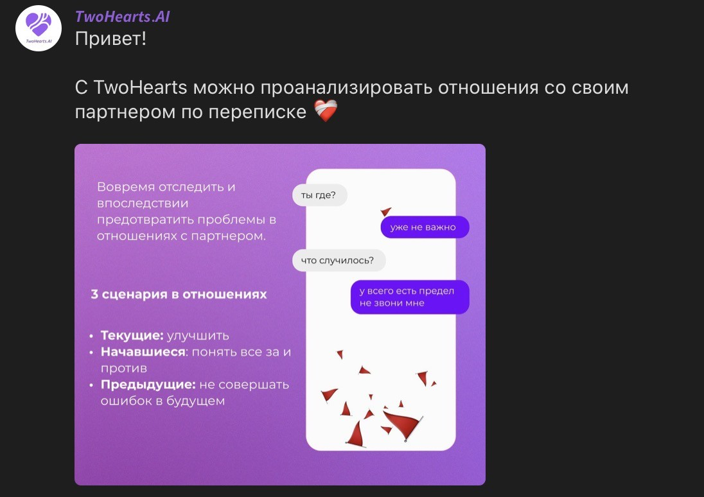

# TwoHearts_AI

## Искусственный интеллект для улучшения ваших отношений

**TwoHearts_AI** — это инновационное приложение, которое анализирует вашу переписку в мессенджерах с помощью искусственного интеллекта, чтобы помочь вам лучше понять и укрепить ваши отношения.

### Как это работает?

Используя передовые большие языковые модели и технологию Retrieval-Augmented Generation (RAG), **TwoHearts_AI** тщательно анализирует ваши сообщения и создает персонализированный отчет с практическими рекомендациями. Наш анализ охватывает ключевые аспекты ваших отношений:

- 💕 **Романтическая динамика**: Оценка флирта и выражения чувств.
- 🤝 **Стили привязанности**: Понимание эмоциональных связей и глубины отношений.
- 🗣️ **Коммуникация**: Анализ открытости, взаимопонимания и экологичности диалога.
- ⚡ **Конфликты и разногласия**: Выявление причин недопонимания и советы по их преодолению.

Каждый отчет сопровождается наглядными примерами из вашей переписки, что делает рекомендации максимально релевантными и применимыми в реальной жизни.

### Почему выбирают TwoHearts_AI?

- 🎓 **Научный подход**: Разработано при участии профессиональных психологов и основано на признанных методиках анализа личности, таких как Майерс-Бриггс и OCEAN.
- 🔒 **Конфиденциальность и безопасность**: Вся обработка данных происходит локально, что гарантирует полную защиту вашей личной информации.
- 🚀 **Технологическое превосходство**: Используем передовые технологии искусственного интеллекта для достижения высокой точности анализа.
- 💡 **Простота использования**: Легкая интеграция с Telegram и другими популярными мессенджерами делает использование приложения максимально удобным.

### Поддержка и партнеры

Мы гордимся тем, что наш проект привлек внимание ведущих технологических компаний, таких как **ВКонтакте** и **Яндекс**. Также мы ожидаем грантовую поддержку от ведущих российских акселераторов, включая **ФРИИ** и **ФАСИ**.

### Почему это важно?

- 🌟 **Для вас**: Улучшение качества отношений, снижение конфликтов и предотвращение недоразумений.
- ❤️ **Для общества**: Содействие укреплению семейных ценностей и снижению числа разводов.
- 📈 **Для бизнеса**: Возможность использования в корпоративной среде для улучшения коммуникации внутри команд.

### Наш путь развития

1. **2024**: Запуск закрытого бета-тестирования в Telegram. Присоединяйтесь к числу первых пользователей!
2. **2025**: Расширение функционала и поддержка новых платформ и мессенджеров.
3. **2026**: Выход на международный рынок и развитие корпоративных решений.

### Присоединяйтесь к нам!

**TwoHearts_AI** делает психологическую поддержку доступной каждому, помогая людям по всему миру стать счастливее и увереннее в своих отношениях.

✨ **Начните улучшать свои отношения уже сегодня с TwoHearts_AI!**

---

**Обратите внимание:** Поскольку приложение является коммерческим продуктом, исходный код не публичен. Доступ к нему может быть предоставлен по запросу экспертов.

---